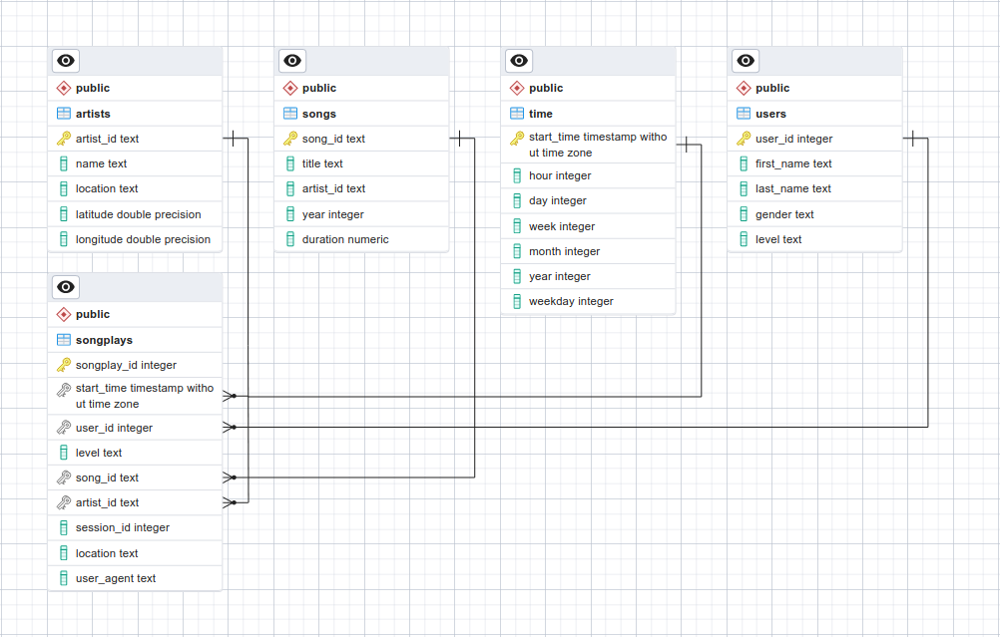

<div id="top"></div>

<!-- TABLE OF CONTENTS -->
<details>
  <summary>Table of Contents</summary>
  <ol>
    <li>
      <a href="#about-the-project">About The Project</a>
      <ul>
        <li><a href="#premise">Premise</a></li>
        <li><a href="#goal">Goal</a></li>
        <li><a href="#data">Data</a></li>
      </ul>
    </li>
    <li>
      <a href="#getting-started">Getting Started</a>
      <ul>
        <li><a href="#setting-up-a-conda-environment">Setting up a conda environment</a></li>
        <li><a href="#initializing-postgresql-database">Initializing PostgreSQL database</a></li>
      </ul>
    </li>
    <li><a href="#usage">Usage</a></li>
    <li><a href="#additional-notes">Additional Notes</a></li>
    <li><a href="#license">License</a></li>
    <li><a href="#contact">Contact</a></li>
    <li><a href="#acknowledgments">Acknowledgments</a></li>
  </ol>
</details>

# Sparkify (using PostgreSQL)

A project from the [Data Engineer Nanodegree Program at Udacity](https://www.udacity.com/course/data-engineer-nanodegree--nd027) to practice data warehouses on the cloud using AWS services.

## About The Project

### Premise

> A music streaming startup, Sparkify, has grown their user base and song database and want to move their processes and data onto the cloud. Their data resides in S3, in a directory of JSON logs on user activity on the app, as well as a directory with JSON metadata on the songs in their app.
>
> As their data engineer, you are tasked with building an ETL pipeline that extracts their data from S3, stages them in Redshift, and transforms data into a set of dimensional tables for their analytics team to continue finding insights into what songs their users are listening to. You'll be able to test your database and ETL pipeline by running queries given to you by the analytics team from Sparkify and compare your results with their expected results.

<p align="right">(<a href="#top">back to top</a>)</p>

### Goal

The goal of this project is to apply what I have on data warehouses and AWS to build an ETL pipeline for a database hosted on Redshift. Data will be loaded from an S3 bucket to staging tables on Redshift. Then, data will be organized into fact and dimension tables following a star schema defined for a particular analytics focus.

<p align="right">(<a href="#top">back to top</a>)</p>

### Data

Data is stored in an S3 bucket:

- **Song data**: `s3://udacity-dend/song_data`
- **Log data**: `s3://udacity-dend/log_data`

Log data json path: `s3://udacity-dend/log_json_path.json`

#### The song dataset

A subset of real data from the [Million Song Dataset](http://millionsongdataset.com/). Each file is in JSON format and contains metadata about a song and the artist of that song. Files are located under in `s3://udacity-dend/song_data`.

For example, this is how the first file (`TRAAAAW128F429D538.json`) looks like:

```json
{
  "num_songs": 1,
  "artist_id": "ARD7TVE1187B99BFB1",
  "artist_latitude": null,
  "artist_longitude": null,
  "artist_location": "California - LA",
  "artist_name": "Casual",
  "song_id": "SOMZWCG12A8C13C480",
  "title": "I Didn't Mean To",
  "duration": 218.93179,
  "year": 0
}

```

#### Log dataset

It is composed of log files in NDJSON format generated by this [event simulator](https://github.com/Interana/eventsim) based on the songs in the dataset above. These simulate activity logs from a music streaming app based on specified configurations. Files are located under `s3://udacity-dend/log_data`.

The log files are named following a date pattern (`{year}_{month}_{day}_events.json`), and below is the first line of the first file (`2018-11-01-events`) as an example:

```json
{
  "artist": null,
  "auth": "Logged In",
  "firstName": "Walter",
  "gender": "M",
  "itemInSession": 0,
  "lastName": "Frye",
  "length": null,
  "level": "free",
  "location": "San Francisco-Oakland-Hayward, CA",
  "method": "GET",
  "page": "Home",
  "registration": 1540919166796.0,
  "sessionId": 38,
  "song": null,
  "status": 200,
  "ts": 1541105830796,
  "userAgent": "\"Mozilla/5.0 (Macintosh; Intel Mac OS X 10_9_4) AppleWebKit/537.36 (KHTML, like Gecko) Chrome/36.0.1985.143 Safari/537.36\"",
  "userId": "39"
}

```

<p align="right">(<a href="#top">back to top</a>)</p>

### Data Schema

This project uses a star schema that is better visualized through an Entity Relationship Diagram (ERD). The following image shows an example ERD, as obtained with **pgadmin4** on a local PostreSQL database.

Here, *songplays* is a **fact table**, whereas *artists*, *songs*, *time* and *users* are **dimension tables**. The fact table is referencing the rest through foreign keys.



<p align="right">(<a href="#top">back to top</a>)</p>

## Getting Started

To make use of this project, I recommend managing the required dependencies with Anaconda.

### Setting up a conda environment

Install miniconda:

```bash
wget https://repo.anaconda.com/miniconda/Miniconda3-latest-Linux-x86_64.sh
bash Miniconda3-latest-Linux-x86_64.sh
```

Install mamba:

```bash
conda install -n base -c conda-forge mamba
```

Install environment using provided file:

```bash
mamba env create -f environment.yml # alternatively use environment_core.yml if base system is not debian
mamba activate sparkify_redshift
```

### Setting up an Amazon Redshift cluster

**Create an IAM user:**

  1. IAM service is a global service, meaning newly created IAM users are not restricted to a specific region by default.
  2. Go to [AWS IAM service](https://console.aws.amazon.com/iam/home#/users) and click on the "**Add user**" button to create a new IAM user in your AWS account.
  3. Choose a name of your choice.
  4. Select "**Programmatic access**" as the access type. Click Next.
  5. Choose the **Attach existing policies directly tab**, and select the "**AdministratorAccess**". Click Next.
  6. Skip adding any tags. Click Next.
  7. Review and create the user. It will show you a pair of access key ID and secret.
  8. Take note of the pair of access key ID and secret. This pair is collectively known as Access key.

**Save access key and secret locally:**

  1. Create a new file, `_user.cfg`, and add the following:

   ```bash
   KEY= <YOUR_AWS_KEY>
   SECRET= <YOUR_AWS_SECRET>
   ```

  2. This file will be loaded internally to connect to AWS and perform various operations.
  3. **DO NOT SHARE THIS FILE WITH ANYONE!** I recommend adding this file to .gitignore to avoid accidentally pushing it to a git repository: `printf "\n_user.cfg\n" >> .gitignore`.

**Create cluster:**
  1. Fill the `dwh.cfg` configuration file. These are the basic parameters that will be used to operate on AWS. More concretely, `GENERAL` covers general parameters, `DWH` includes the necessary information to create and connect to the Redshift cluster and S3 contains information on where to find the source dataset for this project.
  2. To create the Redshift cluster, either run the `create_dwh.py` python script or follow along the notebook `notebooks/main.ipynb`.

## Usage

Project structure:

- `data`: where both datasets are stored.
- `notebooks`: contains Jupyter notebooks for testing purposes.
- `src`: contains the source files and scripts to build and populate the database.

To create the database and tables, run:

```bash
python src/create_tables.py
```

This can also be done from within a python instance:

```python
from create_tables import main as run_create_tables
run_create_tables()
```

To load the data and populate the database, run:

```bash
python src/etl.py
```

This can also be done from within a python instance:

```python
from etl import main as run_etl
run_etl()
```

Helper functions to generate standard SQL queries as well as the database schema can be found in `src/sql_queries.py`.

### Example queries

To query the database, first start a connection:

```python
import psycopg2

conn = psycopg2.connect(
    "host=127.0.0.1 dbname=sparkifydb user=student password=student"
)
cur = conn.cursor()
```

**How many records are in each table?**

```python
from sql_queries import TABLES

for table_name in TABLES.keys():
    cur.execute(
        f"SELECT count(*) FROM {table_name}"
    )
    print(f"{table_name} has {cur.fetchone()[0]} records.")
```

*Output:*

```
users has 96 records.
artists has 69 records.
songs has 71 records.
time has 6813 records.
songplays has 532 records.
```

**Who are the top 5 users with the highest activity?**

```python
cur.execute(
    """
    SELECT
        sub.user_id, users.first_name, users.last_name, sub.counted
    FROM
        (
            SELECT
                songplays.user_id, count(*) AS counted
            FROM
                (songplays JOIN users ON songplays.user_id = users.user_id)
            GROUP BY
                songplays.user_id
        ) sub
    JOIN
        users ON sub.user_id = users.user_id
    ORDER BY
        sub.counted DESC, user_id
    LIMIT 5
    """
)
pd.DataFrame(cur.fetchall(), columns=("user_id", "first_name", "second_name", "count"))
```

*Output:*

```bash
        user_id   first_name    second_name    count

0           29    Jacqueline    Lynch           104
1           97    Kate          Harrell         68
2           95    Sara          Johnson         67
3           49    Chloe         Cuevas          66
4           44    Aleena        Kirby           62
```

When done interacting with the database, close the connection:

```python

conn.close()
```

<p align="right">(<a href="#top">back to top</a>)</p>

## Additional Notes

Source files formatted using the following commands:

```bash
isort .
autoflake -r --in-place --remove-unused-variable --remove-all-unused-imports --ignore-init-module-imports .
black .
```

## License

Distributed under the MIT License. See `LICENSE` for more information.

<p align="right">(<a href="#top">back to top</a>)</p>

## Contact

[Carlos Uziel Pérez Malla](https://www.carlosuziel-pm.dev/)

[GitHub](https://github.com/CarlosUziel) - [Google Scholar](https://scholar.google.es/citations?user=tEz_OeIAAAAJ&hl=es&oi=ao) - [LinkedIn](https://at.linkedin.com/in/carlos-uziel-p%C3%A9rez-malla-323aa5124) - [Twitter](https://twitter.com/perez_malla)

<p align="right">(<a href="#top">back to top</a>)</p>

## Acknowledgments

This README includes a summary of the official project description provided to the students of the [Data Engineer Nanodegree Program at Udacity](https://www.udacity.com/course/data-engineer-nanodegree--nd027).

Part of the contents and structure of this README was inspired by [kenhanscombe](https://github.com/kenhanscombe/project-postgres).

<p align="right">(<a href="#top">back to top</a>)</p>
